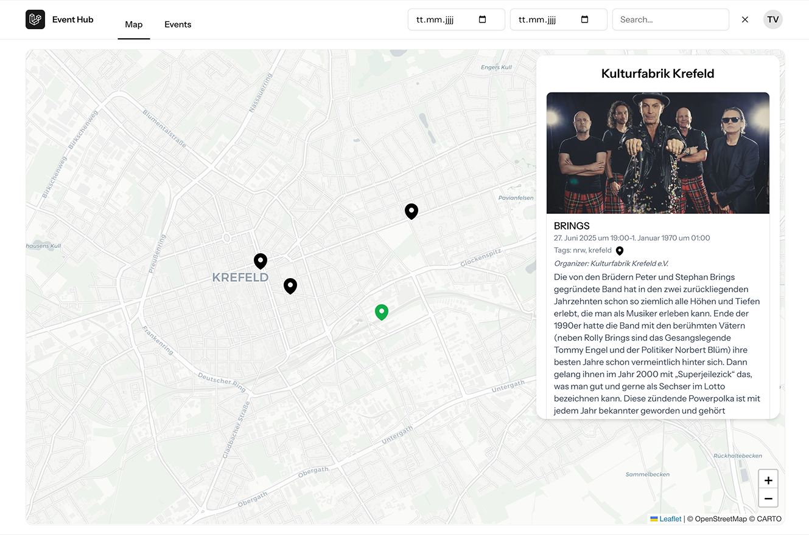

# Event Hub Map

An interactive map application for Event Hub Krefeld that displays local events on a map and provides a list view of upcoming events.

## Introduction

Event Hub Map is a web application that integrates with the Event Hub API to fetch and display events happening in Krefeld, Germany. The application provides two main views:

1. **Map View**: An interactive map that displays event locations, allowing users to visualize where events are taking place.
2. **Events List**: A grid view of upcoming events with details such as title, description, venue, date, and time.

The application is designed to help users discover local events in Krefeld and find their locations easily.



## Features

- Interactive map showing event locations
- List view of upcoming events
- Search functionality for finding specific events
- Authentication system for user access
- Responsive design for desktop and mobile devices
- Integration with Event Hub API for real-time event data

## Technologies

### Backend
- **Laravel 12**: PHP framework for the backend
- **PHP 8.2+**: Programming language
- **Inertia.js**: Server-side rendering with client-side navigation
- **Laravel Sanctum**: Authentication system

### Frontend
- **Vue.js 3**: JavaScript framework for building user interfaces
- **TypeScript**: Type-safe JavaScript
- **Tailwind CSS**: Utility-first CSS framework
- **Pinia**: State management for Vue.js
- **Leaflet**: JavaScript library for interactive maps
- **Vite**: Build tool and development server

## Getting Started

### Prerequisites
- PHP 8.2 or higher
- Composer
- Node.js and npm
- Git

### Installation

1. Clone the repository:
   ```bash
   git clone https://github.com/botibas/event-hub-map.git
   cd event-hub-map
   ```

2. Install PHP dependencies:
   ```bash
   composer install
   ```

3. Install JavaScript dependencies:
   ```bash
   npm install
   ```

4. Copy the environment file and generate an application key:
   ```bash
   cp .env.example .env
   php artisan key:generate
   ```

5. Configure the Event Hub API in your `.env` file:
   ```
   EVENTHUB_URL=your_api_url
   EVENTHUB_TOKEN=your_api_token
   ```

6. Run database migrations:
   ```bash
   php artisan migrate
   ```

7. Build assets:
   ```bash
   npm run build
   ```

### Development

To start the application in development mode, run:

```bash
npm run dev
```

### Testing
test
Run tests with:

```bash
composer test
```

## Project Structure

- `app/`: Contains the backend PHP code
  - `Http/Controllers/`: API and web controllers
  - `Services/`: Service classes including EventHubService
- `resources/`: Contains frontend assets
  - `js/`: Vue components and JavaScript code
    - `components/`: Reusable Vue components
    - `pages/`: Page-level Vue components
    - `store/`: Pinia stores for state management
  - `css/`: Stylesheets
- `routes/`: Contains route definitions
- `config/`: Configuration files

## Contributing

1. Fork the repository
2. Create a feature branch: `git checkout -b feature/your-feature-name`
3. Commit your changes: `git commit -m 'Add some feature'`
4. Push to the branch: `git push origin feature/your-feature-name`
5. Open a pull request

## License

This project is licensed under the MIT License.
